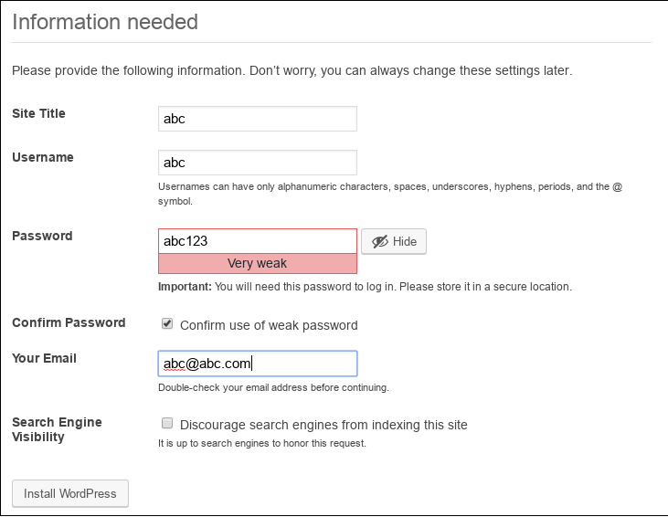
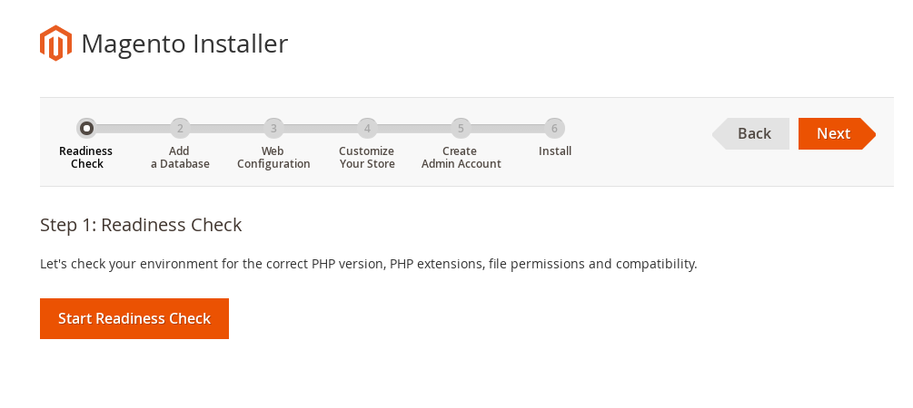
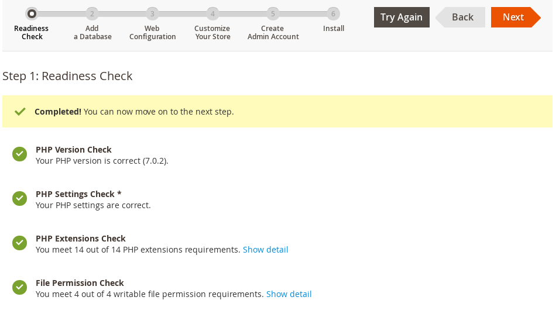
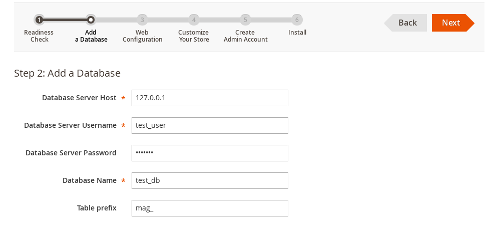
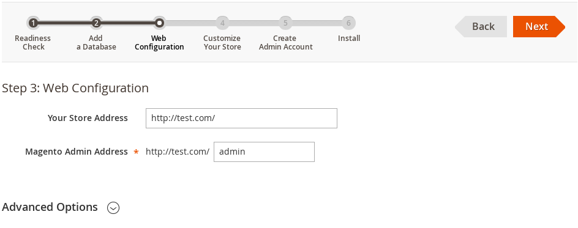
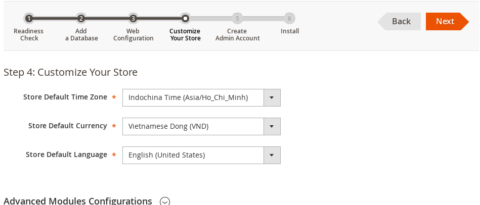
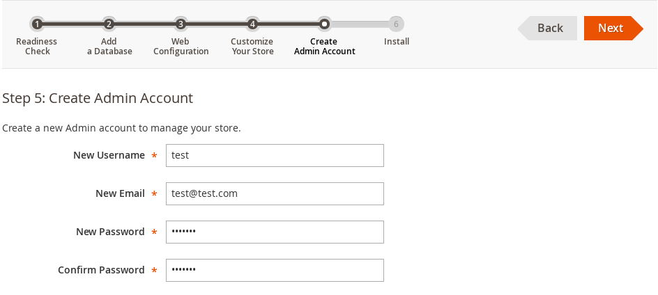
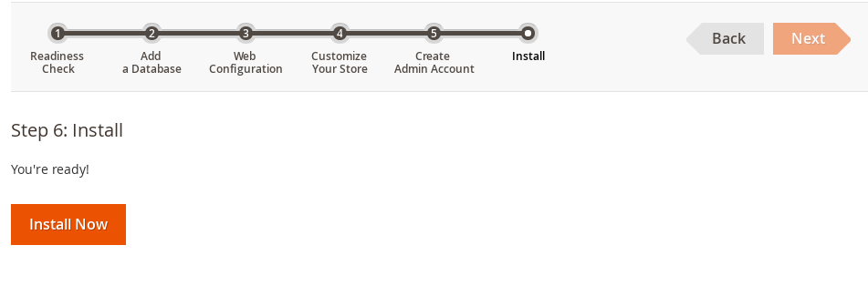
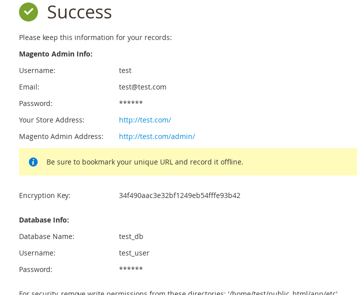

# X. Cài đặt mô hình Reverse Proxy

* **[1. Cài đặt dịch vụ Nginx](README.md#chapter-1)**
* **[2. Cài đặt dịch vụ Httpd](README2.md#chapter-2)**
* **[3. Cài đặt PHP](README3.md#chapter-3)**
* **[4. Cài đặt dịch vụ MySQL](README4.md#chapter-4)**
* **[5. Cấu hình Reverse Proxy](README5.md#chapter-5)**
* **[6. Cấu hình vhost](README6.md#chapter-6)**

<a name="chapter-6"></a>
## 6. Cấu hình vhost

### a. Cấu hình vhost cho abc.com chạy Wordpress

#### Tạo tài khoản `abc`.

- Tạo tài khoản tên là `abc` quản lí tên miền `abc.com`.
```
$ useradd abc
```

#### Tạo các đường dẫn.

- Đường dẫn chứa mã nguồn website.
```
$ mkdir /home/abc/public_html
```

- Đường dẫn chứa log `httpd` và `nginx`.
```
$ mkdir -p /home/abc/logs/httpd
$ mkdir -p /home/abc/logs/nginx
```

#### Tạo file vhost trên httpd.
```
$ vi /etc/httpd/conf.d/abc.com.conf
<VirtualHost 192.168.56.101:8080>
   ServerName abc.com
   ServerAlias www.abc.com
   DocumentRoot /home/abc/public_html
   ErrorLog "/home/abc/logs/httpd/error_log.log"
   CustomLog "/home/abc/logs/httpd/access_log.log" combined
       <Directory "/home/abc/public_html">
               Options +Indexes +FollowSymLinks -Includes
               AllowOverride All
               Require all granted
       </Directory>
       RewriteEngine on
</VirtualHost>
```

#### Tạo file vhost trên nginx.
```
$ vi /etc/nginx/conf.d/abc.com.conf
server {
    listen      192.168.56.101:80;
    server_name abc.com www.abc.com;
    error_log  /home/abc/logs/nginx/error_log.log error;
    access_log  /home/abc/logs/nginx/access_log.log;

    location / {
        proxy_redirect http://www.abc.com:8080 http://www.abc.com;
        proxy_redirect http://abc.com:8080 http://abc.com;

        proxy_pass http://192.168.56.101:8080;

        proxy_set_header Host $host;
        proxy_set_header X-Real-IP $remote_addr;
        proxy_set_header X-Forwarded-For $proxy_add_x_forwarded_for;
        root           /home/abc/public_html;
        expires        max;
        try_files      $uri @fallback;
    }

    location ~* ^.+.(jpg|jpeg|gif|png|ico|css|tar|mid|midi|wav|js)$ {
         expires                 max;
         error_page              404 = @fallback;
    }

    location @fallback {
        proxy_pass      http://192.168.56.101:8080;
    }
}
```

#### Tạo database cho tên miền abc.com

```
mysql> CREATE DATABASE abc_db;
mysql> CREATE USER abc_user@localhost IDENTIFIED BY 'abc123';
mysql> GRANT ALL PRIVILEGES ON abc_db.* TO abc_user@localhost IDENTIFIED BY 'abc123';
mysql> FLUSH PRIVILEGES;
mysql> exit;
```

#### Tải mã nguồn Wordpress.

- Tải mã nguồn Wordpress.
```
$ cd /home/abc/public_html
$ wget http://wordpress.org/latest.tar.gz
```

- Giải nén.
```
$ tar xzvf latest.tar.gz
$ cd wordpress/
$ mv * ../
$ cd ../
$ rm -rf wordpress
```

#### Cấu hình Wordpress

- Chỉnh sửa file config.
```
$ mv /home/abc/public_html/wp-config-sample.php /home/abc/public_html/wp-config.php
$ vi /home/abc/public_html/wp-config.php
...
/** The name of the database for WordPress */
define('DB_NAME', 'abc_db');
/** MySQL database username */
define('DB_USER', 'abc_user');
/** MySQL database password */
define('DB_PASSWORD', 'abc123');
/** MySQL hostname */
define('DB_HOST', '127.0.0.1');
...
```

- Cấu hình cho wp-admin
<p align="center">
  
</p>

### b. Cấu hình vhost cho test.com chạy Magento

#### Tạo tài khoản `test`.

- Tạo tài khoản tên là `test` quản lí tên miền `test.com`.
```
$ useradd test
```

#### Tạo các đường dẫn.

- Đường dẫn chứa mã nguồn website.
```
$ mkdir /home/test/public_html
```

- Đường dẫn chứa log `httpd` và `nginx`.
```
$ mkdir -p /home/test/logs/httpd
$ mkdir -p /home/test/logs/nginx
```

#### Tạo file vhost trên httpd.
```
$ vi /etc/httpd/conf.d/test.com.conf
<VirtualHost 192.168.56.101:8080>
   ServerName test.com
   ServerAlias www.test.com
   DocumentRoot /home/test/public_html
   ErrorLog "/home/test/logs/httpd/error_log.log"
   CustomLog "/home/test/logs/httpd/access_log.log" combined
       <Directory "/home/test/public_html">
               Options +Indexes +FollowSymLinks -Includes
               AllowOverride All
               Require all granted
       </Directory>
       RewriteEngine on
</VirtualHost>
```

#### Tạo file vhost trên nginx.
```
$ vi /etc/nginx/conf.d/test.com.conf
server {
    listen      192.168.56.101:80;
    server_name test.com www.test.com;
    error_log  /home/test/logs/nginx/error_log.log error;
    access_log  /home/test/logs/nginx/access_log.log;

    location / {
        proxy_redirect http://www.test.com:8080 http://www.test.com;
        proxy_redirect http://test.com:8080 http://test.com;

        proxy_pass http://192.168.56.101:8080;

        proxy_set_header Host $host;
        proxy_set_header X-Real-IP $remote_addr;
        proxy_set_header X-Forwarded-For $proxy_add_x_forwarded_for;
        root           /home/test/public_html;
        expires        max;
        try_files      $uri @fallback;
    }

    location ~* ^.+.(jpg|jpeg|gif|png|ico|css|tar|mid|midi|wav|js)$ {
         expires                 max;
         error_page              404 = @fallback;
    }

    location @fallback {
        proxy_pass      http://192.168.56.101:8080;
    }
}
```

#### Tạo database cho tên miền test.com

```
mysql> CREATE DATABASE test_db;
mysql> CREATE USER test_user@localhost IDENTIFIED BY 'test123456';
mysql> GRANT ALL PRIVILEGES ON test_db.* TO test_user@localhost IDENTIFIED BY 'test123456';
mysql> FLUSH PRIVILEGES;
mysql> exit;
```

#### Tải mã nguồn Magento

- Cài đặt Composer
```
$ curl -sS https://getcomposer.org/installer | php
$ mv composer.phar /usr/bin/composer
```

- Tải mã nguồn Magento.
```
$ git clone https://github.com/magento/magento2.git
$ mv magento2/* ./
$ mv mangeto2/.* ./
$ m -rf mangeto2
```

- Phân quyền cho thư mục docroot.
```
$ chown -R test:test /home/test/public_html
$ chmod -R 755 /home/test/public_html
```

#### Cài đặt Magento

- Cài đặt `xsl extensions` cho PHP.
```
$ yum install -y php-xml
$ yum install -y libxslt-devel
$ cd /data/php
$ ./config.nice --with-xsl
$ make
$ make install
```

- Cài đặt `soap extension` cho PHP.
```
$ cd /data/php
$ ./config.nice --enable-soap
$ make
$ make install
```

- Cài đặt Magento từ composer
```
$ cd /home/ttest/public_html
$ composer install
```

- Phân quyền các thư mục.
```
$ chmod -R 777 var
$ chmod -R 777 app/etc/
$ chmod -R 777 pub/media/
$ chmod -R 777 pub/static
```

##### Cài đặt Magento.

- Giao diện cấu hình.
<p align="center">
  
</p>

- Kiểm tra các giá trị cần thiết.
<p align="center">
  
</p>

<p align="center">
  
</p>

- Cấu hình database
<p align="center">
  
</p>

- Cấu hình trang admin
<p align="center">
  
</p>

- Cấu hình cho store
<p align="center">
  
</p>

- Tạo tài khoản admin với user là `test`, pasword là `test123`.
<p align="center">
  
</p>

- Tiến hành cài đặt.
<p align="center">
  
</p>

- Giao diện khi cài đặt thành công.
<p align="center">
  
</p>
