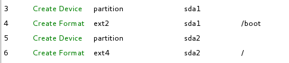
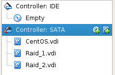
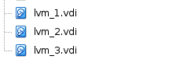

# II. Cài Centos/RAID/LVM

* **[1. Cài 1 máy ảo linux](#buoc-1)**
* **[2. Chia partition](#buoc-2)**
* **[3. Cấu hình RAID](#buoc-3)**
* **[4. Cấu hình LVM](#buoc-4)**

<a name="buoc-1"></a>
### 1. Cài 1 máy ảo linux

* **OS**: CentOS 7.
* **Manpage**: https://www.centos.org/.
* **Virtual Machine**: Virtualbox.

<a name="buoc-2"></a>
### 2. Chia partition

- Hình chụp trong quá trình cài đặt.



- Kiểm tra cấu hình sau khi cài đặt.

```
$ fdisk -l

Disk /dev/sda: 21.5 GB, 21474836480 bytes, 41943040 sectors
Units = sectors of 1 * 512 = 512 bytes
Sector size (logical/physical): 512 bytes / 512 bytes
I/O size (minimum/optimal): 512 bytes / 512 bytes
Disk label type: dos
Disk identifier: 0x0001a71d

   Device Boot      Start         End      Blocks   Id  System
/dev/sda1   *        2048      976895      487424   83  Linux
/dev/sda2          976896    41943039    20483072   83  Linux
```

<a name="buoc-3"></a>
### 3. Cấu hình RAID

#### a. Giới thiệu

RAID (Redundant Arrays of Inexpensive Disks hoặc Redundant Arrays of Independent Disks) là hình thức ghép nhiều ổ đĩa cứng vật lý thành một hệ thống ổ đĩa cứng có chức gia tăng tốc độ đọc/ghi dữ liệu hoặc nhằm tăng thêm sự an toàn của dữ liệu chứa trên hệ thống đĩa hoặc kết hợp cả hai yếu tố trên.

**Wiki page**: https://raid.wiki.kernel.org/index.php

#### b. Phân loại 

| RAID Level | Tính an toàn | Đĩa được sử dụng | Tốc độ đọc/ghi | Min Drives |
| --- | --- | --- | --- | --- |
| 0 | | 100% | Best | 2 |
| 1 | :heavy_check_mark: | 50% | Normal | 2 |
| 5 | :heavy_check_mark: | 67% - 94% | Superior | 3 |
| 6 | :heavy_check_mark: | 50% - 88% | Superior | 4 |

#### c. Cấu hình

- Add thêm 2 ổ cứng `Raid_1.vdi` và `Raid_2.vdi`.



- Phân vùng cho 2 ổ cứng vừa add `/dev/sdb` và `/dev/sdc/`.

```
$ fdisk /dev/sdb
Welcome to fdisk (util-linux 2.23.2).

Changes will remain in memory only, until you decide to write them.
Be careful before using the write command.

Device does not contain a recognized partition table
Building a new DOS disklabel with disk identifier 0xaadb0aa3.

Command (m for help): n
Partition type:
   p   primary (0 primary, 0 extended, 4 free)
   e   extended
Select (default p): p
Partition number (1-4, default 1): 1
First sector (2048-4194303, default 2048): 
Using default value 2048
Last sector, +sectors or +size{K,M,G} (2048-4194303, default 4194303): 
Using default value 4194303
Partition 1 of type Linux and of size 2 GiB is set

Command (m for help): t
Selected partition 1
Hex code (type L to list all codes): fd
Changed type of partition 'Linux' to 'Linux raid autodetect'

Command (m for help): w
The partition table has been altered!

Calling ioctl() to re-read partition table.
Syncing disks.
```

- Cài đặt công cụ `mdadm`
```
$ yum install -y mdadm
```
> **Note**: `mdadm` là công cụ quản lý chuẩn để tạo RAID.

- Kiểm tra phân vùng RAID.
```
$ mdadm -E /dev/sd[b-c]
/dev/sdb:
   MBR Magic : aa55
Partition[0] :      4192256 sectors at         2048 (type fd)
/dev/sdc:
   MBR Magic : aa55
Partition[0] :      4192256 sectors at         2048 (type fd)
```
> **Note**: Option `-E` cho phép in ra nội dung metadata được lưu trữ trên thiết bị.

- Tạo thiết bị RAID 1 `/dev/md0`.
```
$ mdadm --create /dev/md0 --level=mirror --raid-devices=2 /dev/sd[b-c]1
```

- Kiểm tra các mảng đĩa
```
$ cat /proc/mdstat
Personalities : [raid1] 
md0 : active raid1 sdc1[1] sdb1[0]
      2095104 blocks super 1.2 [2/2] [UU]
      [============>........]  resync = 63.0% (1320576/2095104) finish=0.1min speed=66028K/sec
      
unused devices: <none>
```

- Kiểm tra loại thiết bị RAID và mảng RAID.
```
$ mdadm -E /dev/sd[b-c]1
/dev/sdb1:
...
   Raid Level : raid1
 Raid Devices : 2
...
/dev/sdc:
...
   Raid Level : raid1
 Raid Devices : 2
---
```
```
$ mdadm --detail /dev/md0
/dev/md0:
...
    Update Time : Thu Apr 13 23:02:12 2017
          State : clean 
 Active Devices : 2
Working Devices : 2
 Failed Devices : 0
  Spare Devices : 0
...
```
> **Note**: Option `--detail` hiển thị mô tả chi tiết của mảng (thiết bị phải là thiết bị `md` đang hoạt động).

- Tạo filesystem cho thiết bị RAID.
```
$ mkfs.ext4 /dev/md0
```

- Tạo folder `/data` và mount vào `/data`.
```
$ mkdir /data
$ mount /dev/md0 /data/
```

- Auto mount RAID 1 khi khởi động. Thêm dòng bên dưới vào `/etc/fstab`.
```
/dev/md0                /data              ext4    defaults        0 0
```

- Lưu lại các cấu hình vài `mdadm.conf`.
```
$ mdadm --detail --scan --verbose >> /etc/mdadm.conf
```

<a name="buoc-4"></a>
### 4. Cấu hình LVM

#### a. Giới thiệu

LVM là một phương pháp cho phép ấn định không gian đĩa cứng thành những Logical Volume khiến cho việc thay đổi kích thước trở nên dễ dàng ( so với partition ). Với kỹ thuật Logical Volume Manager (LVM) bạn có thể thay đổi kích thước mà không cần phải sửa lại partition table của OS. Điều này thực sự hữu ích với những trường hợp bạn đã sử dụng hết phần bộ nhớ còn trống của partition và muốn mở rộng dung lượng của nó, bạn chỉ cần ấn định lại dung lượng mà không cần phân vùng lại, cũng không phải đối mặt với nguy cơ mất dữ liệu khi thay đổi dung lượng như khi thao tác trên Partition.

#### b. Các thành phần 

- Physical volumes (PV): Là đĩa cứng vật lý trong server.
- Volume Groups (VG): là một tập hợp các PV, từ VG sẽ có thể phân chia thành các Logical Volumes và các Logical Volumes này có thể thay đổi kích thước dễ dàng.
- Logical Volumes (LV): Là các LV tương đương với partition theo cách phân chia truyền thống. LV có thể thay đổi kích thước dễ dàng, tất cả chỉ phụ thuộc vào kích thước của VG.

Một số công cụ:

| Volume | Create | View | Remove | Resize | Change | Scan |
| --- | --- | --- | --- | --- | --- | --- |
| PV | pvcreate | pvs, pvdisplay | pvremove | | pvchange | pvscan |
| VG | vgcreate | vgs, vgdisplay | vgremove | vgextend, vgreduce | vgchange | vgscan |
| LV | lvcreate | lvs, lvdisplay | lvremove | lvextend, lvreduce | lvchange | lvscan |

#### c. Cấu hình

- Add thêm 3 ổ cứng `lvm_1.vdi`, `lvm_2.vdi` và `lvm_3.vdi`, mỗi ổ cứng là 2 GB.



- Phân vùng cho 2 ổ cứng vừa add `/dev/sdd`, `/dev/sde` và `/dev/sdf`.
```
$ fdisk /dev/sdd
Welcome to fdisk (util-linux 2.23.2).

Changes will remain in memory only, until you decide to write them.
Be careful before using the write command.

Device does not contain a recognized partition table
Building a new DOS disklabel with disk identifier 0xe73abbdc.

Command (m for help): n
Partition type:
   p   primary (0 primary, 0 extended, 4 free)
   e   extended
Select (default p): p
Partition number (1-4, default 1): 1
First sector (2048-4194303, default 2048): 
Using default value 2048
Last sector, +sectors or +size{K,M,G} (2048-4194303, default 4194303): 
Using default value 4194303
Partition 1 of type Linux and of size 2 GiB is set

Command (m for help): t
Selected partition 1
Hex code (type L to list all codes): 8e
Changed type of partition 'Linux' to 'Linux LVM'

Command (m for help): w
The partition table has been altered!

Calling ioctl() to re-read partition table.
Syncing disks.
```

- Thiết lập những phân vùng mới từ mỗi LVM partition.
```
$ pvcreate /dev/sdd1  /dev/sde1 /dev/sdf1
  Physical volume "/dev/sdd1" successfully created.
  Physical volume "/dev/sde1" successfully created.
  Physical volume "/dev/sdf1" successfully created.
```

- Kiểm tra lại PV vừa tạo.
```
$ pvs
  PV         VG Fmt  Attr PSize PFree
  /dev/sdd1     lvm2 ---  2.00g 2.00g
  /dev/sde1     lvm2 ---  2.00g 2.00g
  /dev/sdf1     lvm2 ---  2.00g 2.00g
```

- Tạo volume group `lvm` và thêm `/dev/sdd1`, `/dev/sde1`, `/dev/sdf1` vào `lvm`.
```
$ vgcreate lvm /dev/sdd1 /dev/sde1 /dev/sdf1
  Volume group "lvm" successfully created
```

- Kiểm tra VG vừa tạo. Do mỗi partition được chia 2 GB nên tổng sẽ ~ 6 GB.
```
$ vgs
  VG  #PV #LV #SN Attr   VSize VFree
  lvm   3   0   0 wz--n- 5.99g 5.99g
```

- Tạo 2 logical volume (LV) là `data2` và `data3`.
```
$ lvcreate --name data2 --size 3G lvm
  Logical volume "data2" created.
$ lvcreate --name data3 --size 2G lvm
  Logical volume "data3" created.
```

- Kiểm tra lại LV vừa tạo.
```
$ lvs
  LV    VG  Attr       LSize Pool Origin Data%  Meta%  Move Log Cpy%Sync Convert
  data2 lvm -wi-a----- 3.00g                                                    
  data3 lvm -wi-a----- 2.00g 
```

- Tạo filesystem cho cho các volumes.
```
$ mkfs.ext4 /dev/mapper/lvm-data2
$ mkfs.ext4 /dev/mapper/lvm-data3
```

- Mount 2 volumes vào `/data2` và `/data3`.
```
$ mkdir /data2
$ mount /dev/mapper/lvm-data2 /data2
$ mkdir /data3
$ mount /dev/mapper/lvm-data3 /data3
```

- Thiết lập auto mount khi khởi động. Thêm 2 dòng bên dưới vào `/etc/fstab`.
```
/dev/mapper/lvm-data2	/data2	ext4	defaults	0 0
/dev/mapper/lvm-data3	/data3	ext4	defaults	0 0
```